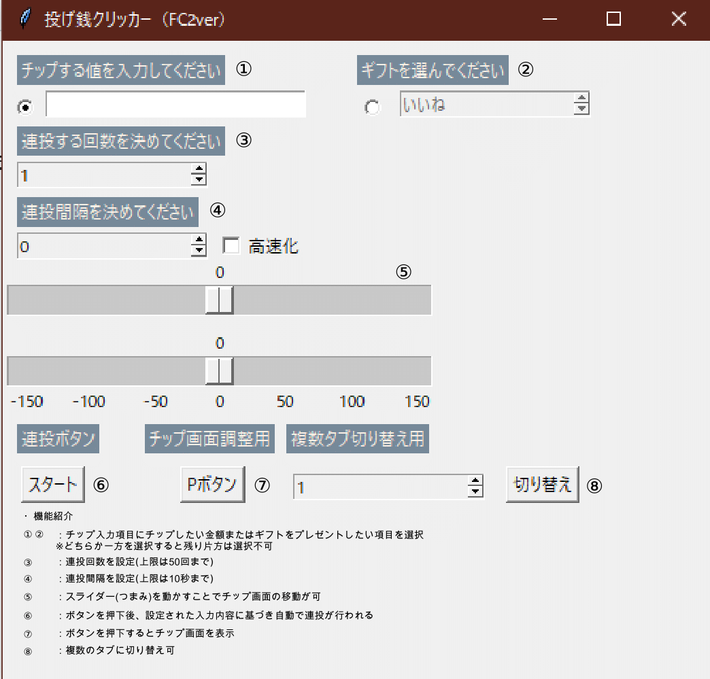

# tipclicker

・このアプリケーションはFC2ライブ配信視聴用のツールです。

・アプリケーションを作成した理由として、応援している配信者さんの配信が盛り上がる又は視聴している人たちも楽しめるように投げ銭を自動で連投できるように作成したツールとなります。

・将来的には、FC2に限らずYoutube用の専用ツールも作成を考えております。

・主な機能として
  
  1. 投げ銭の自動化
  2. 連投回数機能
  3. 連投間隔の設定
  4. チップウィンドウの表示
  5. チップウィンドウの移動化
  6. 複数タブに対応切り替え機能
  7. ギフト用チップにも変更可能なように選択機能

・機能の流れ

  1. チップの金額もしくはギフトを送りたい文字を選択し、連投回数・連投間隔を設定後、スタートを押すことで自動で投げ銭を送ることが可能です。
  2. また、必要に応じて上下左右用のつまみを触ることでチップウィンドウの移動や複数タブへの変更も可能となっております。

・サンプルイメージ

[メイン画面]

[チップ用画面]

[ギフト用動作画面]

  

